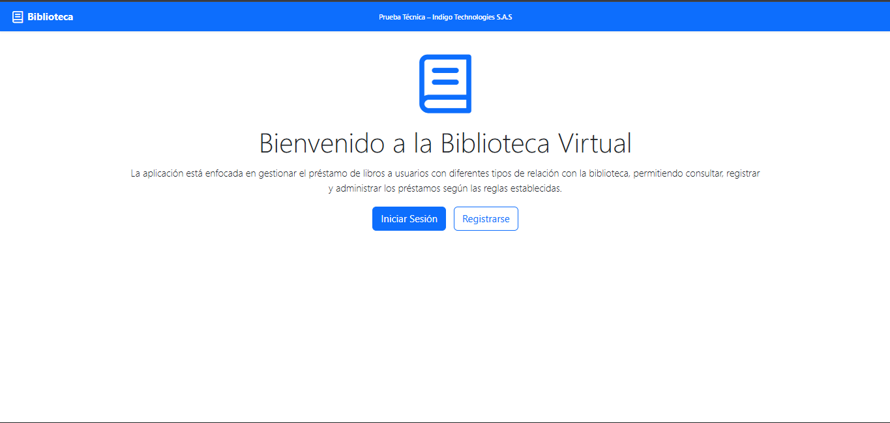
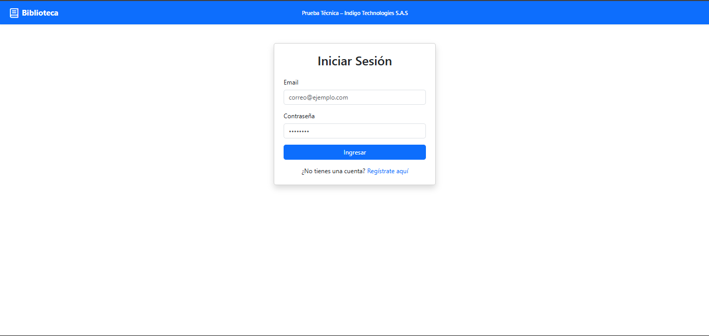
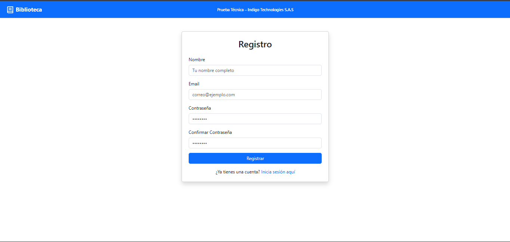

# Prueba Técnica – Indigo Technologies S.A.S

Este proyecto es un Sistema de Gestión de Préstamos de Libros desarrollado con **Laravel (backend)** y **Vue 3 + Vite (frontend)**.

## Aplicación Fullstack construida con:

- Backend: Laravel 11 (API REST)
- Frontend: Vue 3 + Vite
- Estilos: Bootstrap 5 + PrimeIcons
- Base de datos: SQLite : Memoria 
- Autenticación: Laravel Sanctum
- Arquitectura: SPA (Single Page Application) 

## Descripción General
La aplicación se enfocará en gestionar el préstamo de libros por parte de usuarios con diferentes tipos de relación con la biblioteca, permitiendo:

- Crear solicitudes de préstamo
- Consultar préstamos existentes
- Validar reglas según tipo de usuario (afiliado, empleado, invitado)
- Administrar credenciales de acceso mediante login/registro
- Interactuar mediante una SPA simple, responsiva y fácil de usar

Este proyecto fue desarrollado como parte de la Prueba Técnica para ***Indigo Technologies S.A.S.***


## Arquitectura General
📁 backend (Laravel 11 REST API)

📁 frontend (Vue 3 + Vite SPA)

📁 database (SQLite : Memoria)

## Base de Datos
Tablas principales:
- users

Maneja autenticación y roles básicos.

- prestamos

Guarda los datos de los préstamos realizados:

- isbn
- identificacion_usuario
- tipo_usuario
- fecha_prestamo
- fecha_devolucion
- estado

## Reglas de Préstamo Implementadas
Según el tipo de usuario:


| Tipo de Usuario | Días Permitidos | Límite de Préstamos |
| --------------- | --------------- | ------------------- |
| **Afiliado**    | 10 días         | 3 préstamos         |
| **Empleado**    | 7 días          | 2 préstamos         |
| **Invitado**    | 5 días          | 1 préstamo          |

Validaciones:

- No puede solicitar nuevo préstamo si ya superó el límite.
- No puede solicitar si tiene préstamos sin devolver.
- La fecha de devolución se calcula automáticamente según el tipo.


## Requisitos Previos

### Backend

- PHP 8.2+
- Composer
- SQLite

### Frontend

- Node.js 18+
- NPM 9+


## Instalación y Ejecución

### 1. Clona el repositorio

```bash
git https://github.com/Carlos-Leguizamo/PTIndigoBibliotecario.git
cd PTIndigoBibliotecario
```

---

### 2. Configurar el Backend (Laravel)

#### a. Instala dependencias

```bash
cd backend
composer install
```

#### b. Copia y configura el archivo de entorno

```bash
cp .env.example .env
```

- Configura tus credenciales de base de datos en `.env`:

  ```
  DB_CONNECTION=sqlite
  DB_DATABASE=database/database.sqlite

  ```

#### c. Genera la clave de la aplicación

```bash
php artisan key:generate
```

#### d. Ejecuta las migraciones

```bash
php artisan migrate 
```

#### e. Inicia el servidor de desarrollo

```bash
php artisan serve
```

- El backend estará disponible en: `http://127.0.0.1:8000`

---

### 3. Frontend (Vue 3 + Vite)

#### a. Instala dependencias

```bash
cd ../fronted
npm install
```

#### b. Configura la variable de entorno para la URL del backend

Crea un archivo `.env` en la carpeta `fronted` (raiz del proyecto) con el siguiente contenido:

```
VITE_API_BASE = http://127.0.0.1:8000/api
```

> **Nota:** Si el backend corre en otro puerto o dominio, actualiza la URL.

#### c. Inicia el servidor de desarrollo

```bash
npm run dev
```

- El frontend estará disponible en: `http://localhost:5173` (o el puerto que indique Vite).

---


## Endpoints de la API (REST)

### Autenticación

| Método | URL         | Descripción                    |
| ------ | ----------- | ------------------------------ |
| POST   | `/register` | Registro de usuario            |
| POST   | `/login`    | Inicio de sesión               |
| POST   | `/logout`   | Cerrar sesión (requiere token) |

### Préstamos

| Método | URL              | Descripción        |
| ------ | ---------------- | ------------------ |
| POST   | `/prestamo`      | Crear préstamo     |
| GET    | `/prestamo/{id}` | Consultar préstamo |
| GET    | `/prestamo/list` | Consultar préstamos|
| GET    | `/prestamos/list/{id}`| Filtro de préstamos por id|


## Frontend (Vue 3 + Vite)

Funcionalidades:

- SPA con rutas protegidas
- Login y Registro
- Crear préstamo
- Consultar préstamo
- Navbar dinámico
- Componentes visibles según autenticación
- Íconos PrimeVue
- Estilo con Bootstrap
- Home con información alusiva a la prueba técnica

## Rutas del Frontend

| Ruta                  | Descripción                    |
| --------------------- | ------------------------------ |
| `/`                   | Página de bienvenida           |
| `/login`              | Inicio de sesión               |
| `/register`           | Registro                       |
| `/prestamo/crear`     | Crear préstamo (protegida)     |
| `/prestamo/consultar` | Consultar préstamo (protegida) |

## Pruebas

- Validación de reglas de negocio en el backend
- Manejo correcto de fechas
- Cálculo de límites por tipo de usuario
- Autenticación vía token
- SPA funcionando correctamente
---

## Troubleshooting

- Si tienes problemas de CORS, asegúrate de configurar correctamente los headers en Laravel.
- Si cambias la URL del backend, reinicia el servidor de Vite.
- Migraciones fallan: verifica que la base de datos exista y las credenciales en .env sean correctas.

---

---

## Proyecto funcional 

- Home o vista principal



- Login



- Registro 



- Dashboard  - Crear Prestamo - Listado de prestamos 


- Consultar Prestamos


---
---

**Desarrollado por: Carlos Leguizamo**